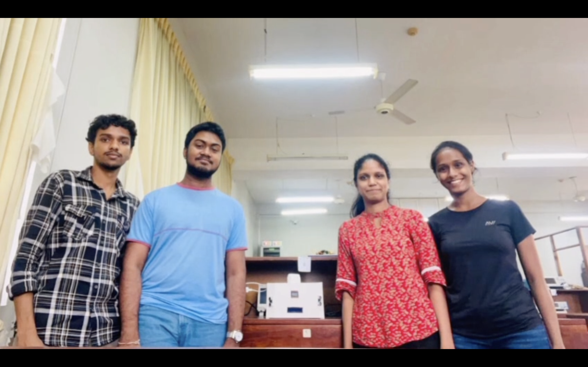
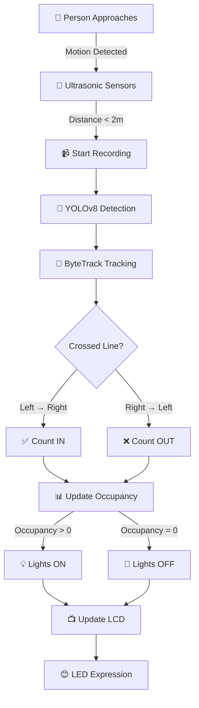

<div align="center">

<!-- Banner -->


# 🎓 Smart Classroom Occupancy Counter

### *Intelligent Human Detection & Tracking System for Raspberry Pi*

<br/>

[](https://python.org)
[](https://opencv.org)
[](https://ultralytics.com)
[](https://raspberrypi.org)

<br/>

*A cutting-edge IoT solution that automatically counts people entering and exiting classrooms using computer vision, ultrasonic sensors, and deep learning.*

<br/>

**🏫 University of Moratuwa | 📡 Dept. of Electronics & Telecommunications | 📅 Term 1 Project**

---


</div>

---

## 🌟 Project Highlights

<table>
<tr>
<td width="50%">

### 🎯 What We Built
A **complete smart classroom system** that:
- 📹 Detects motion using ultrasonic sensors
- 🧠 Identifies humans with YOLOv8 AI
- 📊 Tracks and counts entries/exits
- 💡 Controls lighting based on occupancy
- 📺 Displays status on LCD screen
- 😊 Shows animated faces on LED matrix

</td>
<td width="50%">

### 🏆 Key Achievements
- ✅ Real-time human tracking with ByteTrack
- ✅ Dual camera support (PiCamera + USB)
- ✅ Multi-threaded video processing
- ✅ Smart light automation
- ✅ Interactive visual feedback
- ✅ Complete hardware integration

</td>
</tr>
</table>

---

## 📸 Project Gallery

<div align="center">

### 👥 The Team



*The amazing team behind this project from the Department of Electronics & Telecommunications Engineering, University of Moratuwa*

---

### 🔧 Our Prototype


*The complete hardware setup with Raspberry Pi, sensors, LCD display, and LED matrix*

</div>

---

## 🎥 Video Presentation

<div align="center">

https://github.com/pxn-ai/term_1_project/releases/download/v1.0.0/Video_presentation.mp4

> 📹 **[⬇️ Download Full Video Presentation](https://github.com/pxn-ai/term_1_project/releases/download/v1.0.0/Video_presentation.mp4)**
>
> *The video showcases the complete system in action, including motion detection, human tracking, counting mechanism, and visual feedback.*

</div>

---

## 📊 Presentation Slides

📑 **[View Project Presentation (PPTX)](docs/Project_presentation.pptx)**

---

## ✨ Features

| Feature | Description |
|:-------:|-------------|
| 🎥 **Motion-Triggered Recording** | Ultrasonic sensors detect movement and automatically start recording |
| 🧠 **AI-Powered Detection** | YOLOv8 + ByteTrack for accurate human tracking |
| 📊 **Entry/Exit Counting** | Virtual counting line tracks people crossing in both directions |
| 📺 **LCD Status Display** | Real-time status updates on 16x2 I2C LCD |
| 😊 **LED Matrix Expressions** | Fun animated faces on 8x8 MAX7219 display |
| 💡 **Smart Light Control** | Automatically manages room lighting based on occupancy |
| 🎛️ **Dual Camera Support** | Works with both PiCamera and USB cameras |
| ⚡ **Multi-threaded Processing** | Concurrent video recording and analysis |

---

## 🏗️ System Architecture

```
┌─────────────────────────────────────────────────────────────────────────────┐
│                        SMART CLASSROOM SYSTEM                                │
├─────────────────────────────────────────────────────────────────────────────┤
│                                                                              │
│   ┌──────────────────┐    ┌──────────────────┐    ┌──────────────────┐      │
│   │   🔊 Ultrasonic   │    │    📷 Camera      │    │    💡 GPIO       │      │
│   │     Sensors       │───▶│   (Pi/USB)       │───▶│    Control       │      │
│   │   (Left & Right)  │    │                  │    │    (Lights)      │      │
│   └──────────────────┘    └──────────────────┘    └──────────────────┘      │
│            │                       │                       ▲                 │
│            ▼                       ▼                       │                 │
│   ┌────────────────────────────────────────────────────────┴─────┐          │
│   │                         Main.py                               │          │
│   │              (Motion Detection & Recording)                   │          │
│   └────────────────────────────────────────────────────────┬─────┘          │
│                                │                           │                 │
│                                ▼                           ▼                 │
│   ┌──────────────────┐    ┌──────────────────┐    ┌──────────────────┐      │
│   │    🧠 YOLOv8      │    │    📟 LCD 16x2    │    │   ✨ LED Matrix   │      │
│   │    ByteTrack     │    │     Display      │    │    8x8 Face      │      │
│   │   (Counting)     │    │    (Status)      │    │   (Emotions)     │      │
│   └──────────────────┘    └──────────────────┘    └──────────────────┘      │
│                                                                              │
└─────────────────────────────────────────────────────────────────────────────┘
```

---

## 🔧 Hardware Requirements

| Component | Specification | Quantity |
|:---------:|---------------|:--------:|
| 🖥️ **Raspberry Pi** | Model 4B (2GB+ RAM recommended) | 1 |
| 📷 **Camera** | Pi Camera Module v2 / USB Webcam | 1 |
| 📡 **Ultrasonic Sensor** | HC-SR04 | 2 |
| 📟 **LCD Display** | 16x2 I2C Character LCD (PCF8574) | 1 |
| ✨ **LED Matrix** | 8x8 MAX7219 | 1 |
| 💡 **LED** | Standard LED (for power indicator) | 1 |
| 🔗 **Jumper Wires** | Male-Female, Male-Male | Various |
| ⚡ **Power Supply** | 5V 3A USB-C | 1 |

---

## 📦 Software Requirements

### System Requirements

- **OS:** Raspberry Pi OS (64-bit recommended)
- **Python:** 3.9 or higher
- **SPI:** Enabled for LED matrix
- **I2C:** Enabled for LCD display
- **Camera:** Enabled in raspi-config

### Python Packages

```bash
pip install -r requirements.txt
```

<details>
<summary>📋 View all dependencies</summary>

| Package | Purpose |
|---------|---------|
| `ultralytics>=8.0.0` | YOLOv8 object detection |
| `opencv-python>=4.8.0` | Computer vision |
| `numpy>=1.24.0` | Numerical operations |
| `gpiozero>=1.6.2` | GPIO control |
| `picamera2>=0.3.12` | Pi Camera support |
| `RPLCD>=1.3.0` | LCD display driver |
| `luma.led_matrix>=1.7` | LED matrix driver |

</details>

---

## 📁 Project Structure

```
term_1_project/
│
├── 📂 src/                        # Source code
│   ├── 🚀 Main.py                 # Main application entry point
│   ├── 🧠 Human_Identifier.py     # YOLOv8 human detection & tracking
│   ├── 👁️ eyes.py                 # LED matrix facial expressions
│   ├── 📺 lcd_display.py          # 16x2 LCD display controller
│   ├── 🎭 faces_and_text.py       # LED matrix faces with scrolling text
│   └── 🤖 yolov8n.pt              # YOLOv8 nano model weights
│
├── 📂 utils/                      # Utility scripts
│   ├── 🔬 sensor_check.py         # Hardware testing utility
│   ├── 🎬 demo.py                 # Component demonstration script
│   ├── 📝 practise_file.py        # Sensor practice script
│   └── 🔧 light_control.sh        # Shell script for virtual env
│
├── 📂 media/                      # Media files
│   ├── 📸 photos/                 # Project photos
│   │   ├── Group_photo.png        # Team photo
│   │   └── prototype.png          # Hardware prototype
│   └── 🎥 videos/                 # Video presentations
│       └── Video_presentation.mp4
│
├── 📂 docs/                       # Documentation
│   └── 📑 Project_presentation.pptx
│
├── 📋 requirements.txt            # Python dependencies
└── 📖 README.md                   # This file
```

---

## 🚀 Installation & Setup

### Step 1: Clone the Repository

```bash
git clone https://github.com/pxn-ai/term_1_project.git
cd term_1_project
```

### Step 2: Enable Required Interfaces

```bash
sudo raspi-config
```
Navigate to **Interface Options** and enable:
- ✅ Camera
- ✅ SPI
- ✅ I2C

### Step 3: Create Virtual Environment

```bash
python3 -m venv venv
source venv/bin/activate
```

### Step 4: Install Dependencies

```bash
pip install --upgrade pip
pip install -r requirements.txt
```

### Step 5: Verify Hardware Connections

```bash
# Test sensors and LED
python utils/sensor_check.py

# Test LCD and LED matrix
python utils/demo.py
```

---

## 💻 Usage

### 🎬 Live Mode (Full System)

Run the complete smart classroom system with motion detection:

```bash
cd src
python Main.py
```

**Options:**
```bash
python Main.py --model n --line 0.5 --skip 1
```

### 📹 Video Analysis Mode

Analyze a pre-recorded video:

```bash
cd src
python Main.py video.mp4 --output result.mp4 --preview
```

### Command Line Arguments

| Argument | Description | Default |
|----------|-------------|---------|
| `video` | Path to video file (optional) | Live mode |
| `--output` | Save annotated video | None |
| `--preview` | Show live preview | False |
| `--model` | YOLO model size: `n` (nano), `s` (small) | `n` |
| `--skip` | Process every Nth frame | `1` |
| `--line` | Counting line position (0.0-1.0) | `0.5` |
| `--json` | Save results to JSON | None |

---

## 🔌 Hardware Wiring

### GPIO Pin Configuration

| Component | GPIO Pin | Physical Pin |
|-----------|:--------:|:------------:|
| **Power LED** | GPIO 17 | Pin 11 |
| **Left Ultrasonic Trigger** | GPIO 22 | Pin 15 |
| **Left Ultrasonic Echo** | GPIO 27 | Pin 13 |
| **Right Ultrasonic Trigger** | GPIO 24 | Pin 18 |
| **Right Ultrasonic Echo** | GPIO 23 | Pin 16 |
| **I2C SDA (LCD)** | GPIO 2 | Pin 3 |
| **I2C SCL (LCD)** | GPIO 3 | Pin 5 |
| **SPI MOSI (LED Matrix)** | GPIO 10 | Pin 19 |
| **SPI SCLK (LED Matrix)** | GPIO 11 | Pin 23 |
| **SPI CE0 (LED Matrix)** | GPIO 8 | Pin 24 |

---

## 🎯 How It Works

<div align="center">



</div>

### Step-by-Step Process

| Step | Description |
|:----:|-------------|
| **1️⃣** | Two ultrasonic sensors continuously monitor the doorway |
| **2️⃣** | When someone comes within 2 meters, recording begins |
| **3️⃣** | Camera captures video while motion is detected |
| **4️⃣** | YOLOv8 nano model detects humans in each frame |
| **5️⃣** | ByteTrack algorithm assigns unique IDs to each person |
| **6️⃣** | Virtual counting line tracks direction of movement |
| **7️⃣** | System calculates net entries (entered - exited) |
| **8️⃣** | Room lighting is controlled based on occupancy |
| **9️⃣** | LCD shows status, LED matrix displays expressions |

---

## ⚙️ Configuration

### Adjusting Detection Range

In `src/Main.py`, modify:
```python
detection_range = 200  # Distance in cm (default: 2 meters)
```

### Camera Selection

```python
USB_Camera_preferred = False  # True for USB webcam, False for PiCamera
```

### Frame Resolution

```python
frame_width, frame_height = 1280, 720  # Video resolution
```

---

## 🖥️ Running on a Laptop (Simulation Mode)

To run the video analysis portion on any laptop without Raspberry Pi hardware:

### 1. Install Dependencies
```bash
pip install ultralytics opencv-python numpy
```

### 2. Analyze Video Files
```bash
cd src
python Human_Identifier.py --video your_video.mp4 --output result.mp4 --preview
```

> ⚠️ **Note:** GPIO-dependent features (sensors, LCD, LED matrix) require Raspberry Pi hardware. The video analysis module works independently on any system.

---

## 📊 Performance Tips

| Tip | Description |
|:---:|-------------|
| 🔧 | Use `--skip 2` to process every 2nd frame for faster analysis |
| 📉 | Use model `n` (nano) which is optimized for Raspberry Pi |
| 🔄 | Reduce resolution for faster processing |
| 🧊 | Add heatsink to prevent thermal throttling on Pi |

---

## 🐛 Troubleshooting

| Issue | Solution |
|-------|----------|
| Camera not found | Run `sudo raspi-config` and enable camera |
| LCD not displaying | Check I2C address: `sudo i2cdetect -y 1` |
| LED matrix issues | Verify SPI is enabled in raspi-config |
| Sensors not working | Check GPIO connections and pin numbers |
| Model download fails | Manually download `yolov8n.pt` |

---

## 🤝 Contributing

Contributions are welcome! Please feel free to submit a Pull Request.

1. Fork the repository
2. Create your feature branch (`git checkout -b feature/AmazingFeature`)
3. Commit your changes (`git commit -m 'Add some AmazingFeature'`)
4. Push to the branch (`git push origin feature/AmazingFeature`)
5. Open a Pull Request

---

## 📄 License

This project is part of the **University of Moratuwa ENTC curriculum**.

---

## 🙏 Acknowledgements

- **University of Moratuwa** - For providing the opportunity and resources
- **Department of Electronics & Telecommunications** - For guidance and support
- **Ultralytics** - For the amazing YOLOv8 framework
- Our mentors and instructors for their valuable guidance

---

<div align="center">

### Made with ❤️ by ENTC Students

**University of Moratuwa, Sri Lanka 🇱🇰**

<br/>

[](https://github.com/pxn-ai/term_1_project)
[](https://linkedin.com)

<br/>

⭐ **Star this repo if you found it helpful!** ⭐


</div>
